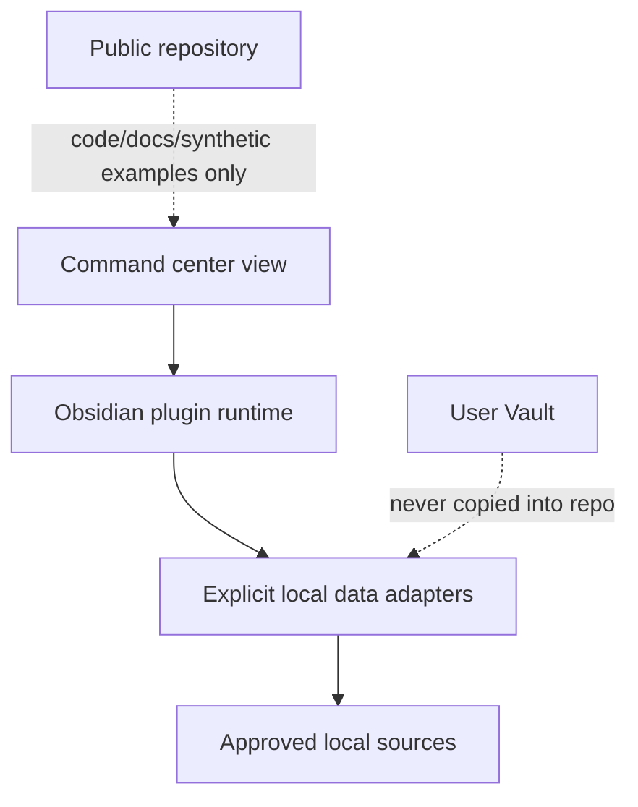

# Architecture and privacy boundary

## Phase 0 status

Phase 0 establishes repository structure and documents the target direction. The only implemented artifact is the preserved web prototype under `prototypes/web-v0/`; no plugin runtime exists yet.

## Source facts

The current prototype is a client-side React/Vite app with static arrays and local component state. It has no backend, persistence layer, Obsidian API calls, Vault reader, or real data connection. Its prototype dependency and build files remain together under `prototypes/web-v0/`.

## Target local-first shape

The following is an architecture decision for future phases, not current implementation:

The plugin should request only the minimum local data needed for an explicitly documented workflow. Any future adapter must state its source, fields, failure state, and whether it writes back to the Vault.

## Repository boundary

Allowed in this repository:

- Source code and configuration needed to build the project.
- Architecture, product, roadmap, and progress documentation.
- Intentionally synthetic examples that contain no personal or secret values.
- The preserved web prototype.

Not allowed:

- Obsidian Vault notes, attachments, `.obsidian/` settings, or exports.
- `.env`, credentials, API tokens, `data.json`, or machine-specific secrets.
- Personal identifiers or real operational records.

The root `.gitignore` provides a defense-in-depth guard for common local paths. It is not an access-control system and is not permission to place Vault data in the repository. A file that is ignored must still not be copied into the repository workflow.

## Data-flow rules

1. A future feature must name its local source before implementation.
2. Data must be minimized at the adapter boundary.
3. Missing, stale, or unavailable data must remain distinguishable from a healthy value.
4. Writes to local sources require a separate scope decision and explicit verification.
5. No private data may be used as a fixture, screenshot, test artifact, commit, or Pull Request attachment.

## Fedora adaptations

- Use the actual checkout path supplied by the session: `/home/sg8/devProject/silver-command-center`.
- Keep paths portable and case-sensitive; do not embed a personal Vault location in code.
- Keep local dependencies and build output untracked.
- Defer plugin build/runtime checks until the relevant Phase 1 toolchain is intentionally introduced.
