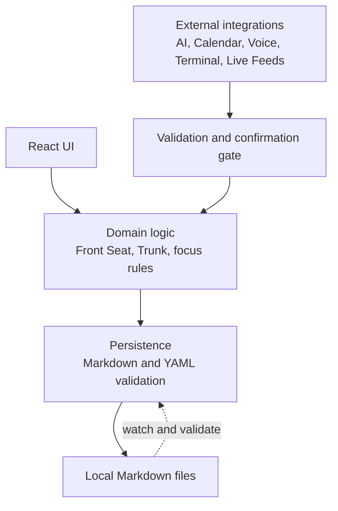

# Architecture and privacy boundary

## Phase status

Phase 0 implementation is complete and PR #1 is merged. Phase 1 implementation and verification are complete on `feat/phase-1-plugin-scaffold`; Draft PR #2 is pending review and explicit merge approval. No domain feature or Vault integration is present.

## Phase 1 placeholder navigation

The Phase 1 view exposes exactly five placeholder navigation tabs:

- `Work`
- `Build`
- `Learn`
- `Create`
- `Inspired`

These tabs provide navigation and active/focus state only. They do not represent Core MVP domain behavior, read Vault data, or create persistence.

## Architecture principles

- Markdown files are the source of truth for user-authored work data.
- React state is temporary working state. It may support interaction and optimistic display, but it is not durable truth.
- UI, domain logic, persistence, and external integrations remain separate layers with explicit boundaries.
- YAML frontmatter and Markdown content must be validated before they are read as domain data or written back.
- File writes must be safe: preserve content outside the intended change, use atomic or equivalent safe-write behavior, and surface failures.
- File watchers must prevent self-triggered loops, duplicate processing, stale writes, and race conditions between dashboard edits and external Markdown edits.
- Every view must handle loading, empty, error, and offline states explicitly.
- External writes and AI apply actions require validation plus explicit user confirmation before execution.
- Secrets must never be stored in Markdown, `data.json`, source files, or Git.

## Layer boundaries

The UI must not write files directly. Domain logic must not depend on a specific external integration. Persistence owns parsing, validation, safe writes, and watcher coordination. External integrations may propose changes, but the confirmation gate controls whether a write is applied.

## Core data model direction

The target model is intentionally small:

- `Front Seat`: exactly one MIT.
- `Trunk`: deferred tasks that are not currently the MIT.
- `Focus session`: Pomodoro/focus timer state associated with the active work context.

Missions, Signals, and Team are labels from the preserved prototype, not architectural domain entities for the Core MVP.

## Persistence and synchronization

1. Load Markdown files and validate YAML frontmatter before exposing data to the domain layer.
2. Convert valid data into temporary React view state.
3. Persist dashboard changes back to the authoritative Markdown file through the persistence layer.
4. Watch for external Markdown changes, debounce and identify the source of each event, then validate before updating the domain/UI.
5. Detect conflicts or invalid data rather than silently overwriting the file.
6. Persist the required state so it remains available after an Obsidian restart.

## Privacy boundary

Allowed in this repository:

- Source code, configuration, and documentation.
- Synthetic examples with no personal or secret values.
- The preserved web prototype.

Not allowed:

- Obsidian Vault notes, attachments, `.obsidian/` settings, or exports.
- Secrets, API tokens, credentials, `.env` files, `data.json`, or personal identifiers.
- Real operational records, private screenshots, or AI/external integration payloads.

The root `.gitignore` is a defense-in-depth guard for common local paths. It is not an access-control system and is not permission to place Vault data in the repository.

## Fedora adaptations

- Use the actual checkout path supplied by the session and keep paths portable.
- Respect Fedora's case-sensitive filesystem.
- Do not embed a personal Vault location in code or documentation.
- Verify the available Obsidian/plugin toolchain before introducing Phase 1 build commands.
